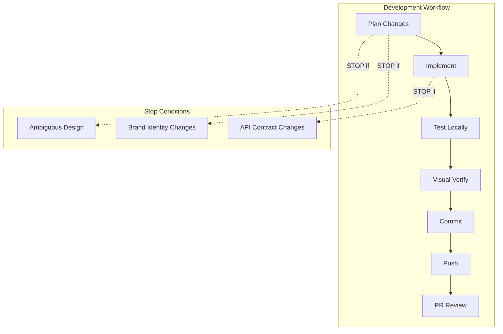

# Core Principles

> Core principles, workflow, and execution requirements for Bridge Storage website development

**Priority:** Always

---

## System Overview



## AI Thrash Prevention

**CRITICAL**: Before making any changes, you MUST:

1. **Explicit Plan**: State what you're doing and why
2. **File List**: List all files you will touch (create/modify/delete)
3. **Todo List**: Create a todo list (using TaskCreate) for any task with 3+ steps
4. **Stop Conditions**: If ambiguity exists, STOP and ask for clarification
5. **Small Diffs**: Prefer incremental changes over large refactors

## When to Stop and Ask

- Ambiguous design requirements or conflicting visual references
- Brand identity changes (colors, fonts, tagline, logo)
- Changes that affect the bridge-ai API contract
- Photo asset reorganization that would break references
- UX flow changes that contradict BUILDPLAN.md

## Commit Message Format

```
type(scope): subject

[detailed description]
```

Types: `feat`, `fix`, `docs`, `style`, `refactor`, `chore`
Scopes: `homepage`, `storage`, `spaces`, `events`, `photos`, `planning`, `brand`, `assets`, `js`

## Plan File Conventions

**CRITICAL: NEVER use the built-in EnterPlanMode tool.** Instead:
- Create plan files manually in `.claude/plans/` using the Write tool
- Use descriptive filenames: `{feature-name}.md`
- Section headings include status: `## Phase 2: Title [IN PROGRESS]`
- Items use checkboxes: `- [x] Done` / `- [ ] Todo`
- First line after title: `Status: IN PROGRESS | Phase 2 of 4`

## Project Structure

```
bridgestorage-website/
├── index.html                  # Main site entry point
├── storage.html                # Unit browsing + filtering
├── spaces.html                 # Space browsing + booking
├── events.html                 # Events calendar + RSVP
├── js/
│   ├── config.js               # API base URL configuration
│   ├── bridge-units.js         # Unit filtering
│   ├── bridge-booking.js       # Space booking flow
│   └── bridge-events.js        # Events + RSVP
├── photos/                     # Optimized facility photos
├── bridge-mobile-design.html   # Design prototype (reference)
├── BUILDPLAN.md                # Implementation plan
├── bridge-ai-integration.md    # API architecture
├── bridge-marketing-plan.md    # Marketing strategy
└── .claude/                    # Claude Code configuration
```

## Git Workflow

**NEVER commit directly to `main`. Always use feature branches.**

```bash
git checkout -b feature/website/<description>
git push -u origin feature/website/<description>
gh pr create --title "..." --body "..."
```
